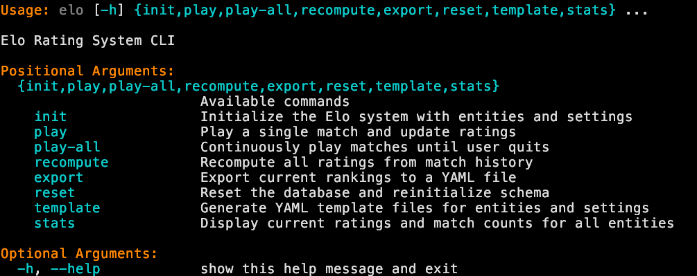

# ♟️ Elo Rating CLI

Elo rating tool for any “things” you want to rank. Built with Python.

---

## 🚀 Features

- Initialize a rating pool from YAML templates  
- Play single or continuous matches (random or "smart" pairing)  
- Recompute all ratings from history  
- Export current rankings to YAML  
- Built‑in templates for quick start  
- Configurable K‑factors and provisional thresholds  

---

## ⚙️ Installation

```bash
pip install git+https://github.com/biosafetylvl5/elo_cli.git
```

---

## 🛠️ Usage



1. **Generate templates**  
   ```bash
   elo template --dir ./config
   ```  
   Creates `things.yaml` and `settings.yaml` in `./config`.

2. **Initialize database**  
   ```bash
   elo init --things ./config/things.yaml --settings ./config/settings.yaml
   ```  
   Resets DB, adds entities with initial rating.

3. **Play a single match**  
   ```bash
   elo play [--smart]
   ```  
   Interactive prompt; use `--smart` to pair closest ratings.
   

4. **Continuous play**  
   ```bash
   elo play-all [--smart] [--assume-win]
   ```  
   Loop matches until “quit”; `--assume-win` auto‑assigns repeat winners.

5. **Recompute ratings**  
   ```bash
   elo recompute --settings ./config/settings.yaml
   ```  
   Resets & replays all matches from history.

6. **Export rankings**  
   ```bash
   elo export [--output rankings.yaml]
   ```  
   Dumps sorted ratings & match counts to YAML.

7. **Reset database**  
   ```bash
   elo reset
   ```

8. **Show stats**  
   ```bash
   elo stats
   ```  
   Prints current ratings & match counts.

---

## 📄 Configuration

- **things.yaml**  
  ```yaml
  - Chocolate
  - Banana
  - Vanilla
  ```

- **settings.yaml**  
  ```yaml
  initial_rating: 1500
  k_factor: 32
  provisional_k_factor: 64  # optional
  ```

Environment variable `ELO_DB_PATH` can override the default SQLite file (`elo_system.db`).

---

## 🤝 Contributing

1. Fork the repo  
1. Create a branch (`git checkout -b feature/xyz`)  
1. Blacken your code (`black .`)
1. Commit your changes (`git commit -m "Add xyz"`)  
1. Push to origin (`git push origin feature/xyz`)  
1. Open a Pull Request  

---

## 📜 License

TODO.
